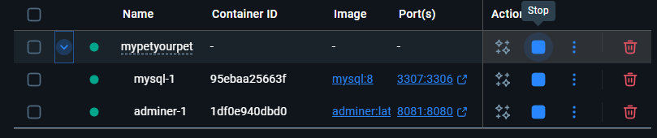
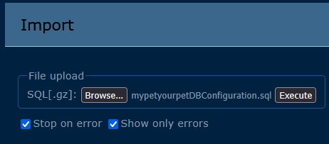

# React + Vite

This template provides a minimal setup to get React working in Vite with HMR and some ESLint rules.

Currently, two official plugins are available:

- [@vitejs/plugin-react](https://github.com/vitejs/vite-plugin-react/blob/main/packages/plugin-react) uses [Babel](https://babeljs.io/) (or [oxc](https://oxc.rs) when used in [rolldown-vite](https://vite.dev/guide/rolldown)) for Fast Refresh
- [@vitejs/plugin-react-swc](https://github.com/vitejs/vite-plugin-react/blob/main/packages/plugin-react-swc) uses [SWC](https://swc.rs/) for Fast Refresh

## React Compiler

The React Compiler is not enabled on this template because of its impact on dev & build performances. To add it, see [this documentation](https://react.dev/learn/react-compiler/installation).

## Expanding the ESLint configuration

If you are developing a production application, we recommend using TypeScript with type-aware lint rules enabled. Check out the [TS template](https://github.com/vitejs/vite/tree/main/packages/create-vite/template-react-ts) for information on how to integrate TypeScript and [`typescript-eslint`](https://typescript-eslint.io) in your project.


# MYPETYOURPET INSTALLATION GUIDE 

In this guide we will follow step-by-step how to install and run the MyPetYourPet project for Backend and Frontend.

## Requisites 

Ensure `java 17 or higher` is installed:

```
java -version
```

If is not installed or is not 17 or higher 🔗 [install or update Java](https://www.oracle.com/ca-en/java/technologies/java-se-glance.html)

---

Ensure `node.js 25 or higher` is installed:
```
node -v
```
or
```
node --version
```

If is not installed or is not 25 or higher 🔗 [install or update Node.js](https://nodejs.org/en/download/current)

---

Ensure the `8080`, `8081`, `3000` and `3007` ports are not in use.

```
netstat
```

## Configure Backend

### Project
Clone the [mypetyourpet backend repository](https://github.com/XolSM/MyPetYourPet)
```
git clone https://github.com/XolSM/MyPetYourPet.git
```
> ⚠️ DO NOT RUN IT YET

### Intellij
[Download Intellij Idea](https://lp.jetbrains.com/intellij-idea-promo/) and install.

### Docker
[Download Docker desktop](https://www.docker.com/) then create an account and login.

### Opening the project

#### ⚠️ Firebase configuration file
- Please find the following file in the submission package: `firebase-service-account.json` and make sure to save it in the following route: myPetYourPet\src\main\resources. As this pacakage contains sensitive information, even github flags it and provides warnings not to include it in the repository.


After adding the `firebase-service-account.json` file, open the project in Intellij Idea.

Ensure to Reload Maven dependencies


Open `Docker desktop app` and run the following command:
```
docker compose up -d
```
Docker configuration should create all containers and tables when you run the app.

Make sure the containers are running after the command finishes.



### Opening Adminer
In any web browser 🔗 [open adminer](http://localhost:8081/)
```
http://localhost:8081/ 
```

Enter the following credentials and log in.

| Input | Value |
| ------- | ---------------- |
| System | `MySQL / MariaDB` |
| Server | `mysql` |
| Username | `root` |
| Password | `root` |
| Database | `mypetyourpet`|


#### Importing the database.
Select the `Import` option and load the `mypetyourpetDBConfiguration.sql` file using the `File upload` section.



### Run the backend
Once the database is imported successfully, return to Intellij Idea and RUN ▶️ the backend.

**NOTE** If project can't run, verify OpenJDK is installed, the Intellij Idea will suggest and handle its installation.


*Suggested installation*


## Configure Frontend

### Project
Clone the [mypetyourpet frontend repository](https://github.com/XolSM/MyPetYourPet)
```
git clone https://github.com/peamable/MyPetYourPet-Frontend.git
```

Run
```
npm install
npm run dev
```

Once is running, [open the frontend](http://localhost:3000/) in any web browser
```
http://localhost:3000/
```

### Users and password to test

| Role | Email | Password | 
| --- | --- | --- | 
| Admin | admin@gmail.com | `123456` |
| Owner | em@mail.com | `1234567` |
| Owner | my@mail.com | `1234567` |
| Seeker | lxz@mail.com | `1234567` |
| Seeker | Ll@mail.com | `1234567` |
| Seeker | testseeker@mail.com | `2222222` |